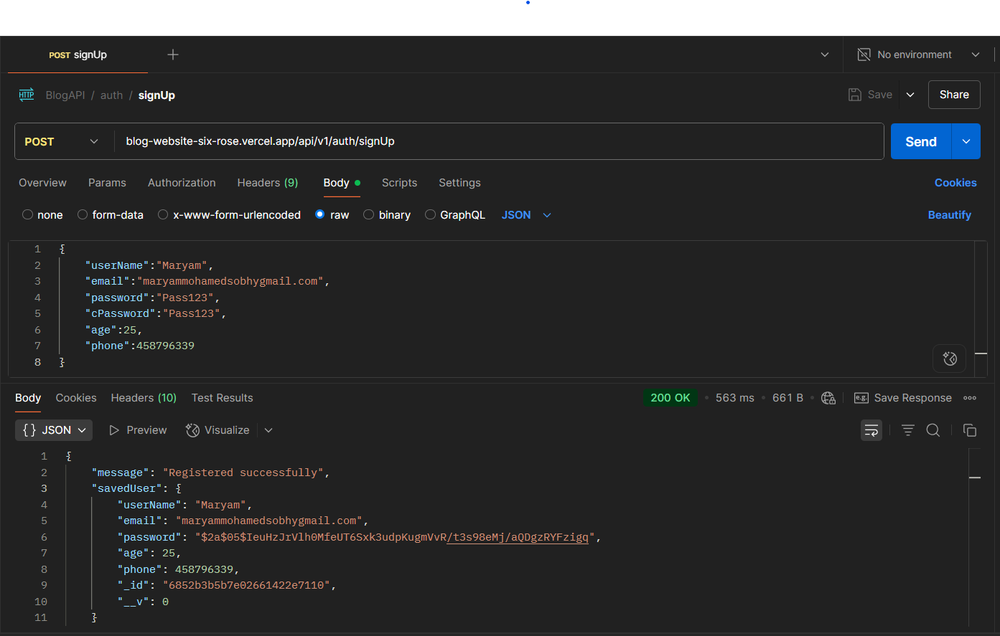

# 📝 BlogAPI

A secure and scalable RESTful API for managing posts and comments, built with Node.js (Express.js) and MongoDB. The system includes full user authentication and authorization using JWT tokens, enabling users to register, log in, create posts, and engage through comments. All endpoints are thoroughly tested using Postman to ensure reliability and performance.

---
## 🔧 Tech Stack

- **Node.js** & **Express.js** – Server-side runtime and framework

- **MongoDB** & **Mongoose** – NoSQL database and ODM

- **JWT Authentication** – Secure token-based auth system

- **RESTful API** – Standardized and scalable endpoints

- **Postman** – API testing and validation

---

## 🚀 Features

- ✍️ Post Management (CRUD) – Create, read, update, and delete blog posts.
  
- 💬 Comment System – Users can comment on posts with proper user-post references.
  
- 🔐 User Authentication – Secure registration and login with hashed passwords and JWT tokens.

- 🧑 User Profiles – Includes user details like name, email, age, and phone.

- 🔗 Relational Data Handling – Posts link to users and comments; comments link back to users and posts.

- 🛡️ Access Control – Only content creators can modify or delete their posts/comments.

- ⚙️ Environment Configuration – Using .env for secure and flexible setup.

- 🚦 Error Handling – Consistent status codes and descriptive error messages.

## 📁 Project Structure

```
├── DB/            # Database connection setup and seed scripts
├── config/        # Environment variables and JWT configuration
├── src/           # Application logic: models, routes, and controllers
├── app.js         # Main Express application entry point
└── package.json   # Project metadata and dependencies
```


---
## 🧪 API Testing

Use **Postman** to interact with and test the API endpoints. Below are the key endpoints along with request methods, example payloads, expected responses, and authentication details where applicable.


---

## 📘 Complete API Usage Guide
### 1. Register a New User  
- **Endpoint:** `POST /api/v1/auth/signUp`  
- **Description:** Create a new user account.  
- **Request Body (JSON):**
```json
{
    "userName":"Maryam",
    "email":"maryammohamedsobhygmail.com",
    "password":"Pass123",
    "cPassword":"Pass123", 
    "age":25, 
    "phone":458796339
}
```

Successful Response (201 Created):
```json
{
    "message": "Registered successfully",
    "savedUser": {
        "userName": "Maryam",
        "email": "maryammohamedsobhygmail.com",
        "password": "$2a$05$2NqyaqC6qOQ2TWNWgBh8m.dD7rcACv6XdCKwwNm7BTD2KI5ON69Fa",
        "age": 25,
        "phone": 458796339,
        "_id": "6852b2d9b7e02661422e710c",
        "__v": 0
    }
}


```

#### ⚠️ Edge Case:
**Email Already Registered**
If a user tries to register again using the same email, the API responds the following Response:

Response (409 Conflict):

```json
{
    "message": "Already register"
}
```
#### 📷 SignUp API


[📬 Click here to open the signUp request](https://www.postman.com/graduation-space-584306/blogapi/request/sw9yzxo/blogapi?action=share&creator=21090382&ctx=documentation)


